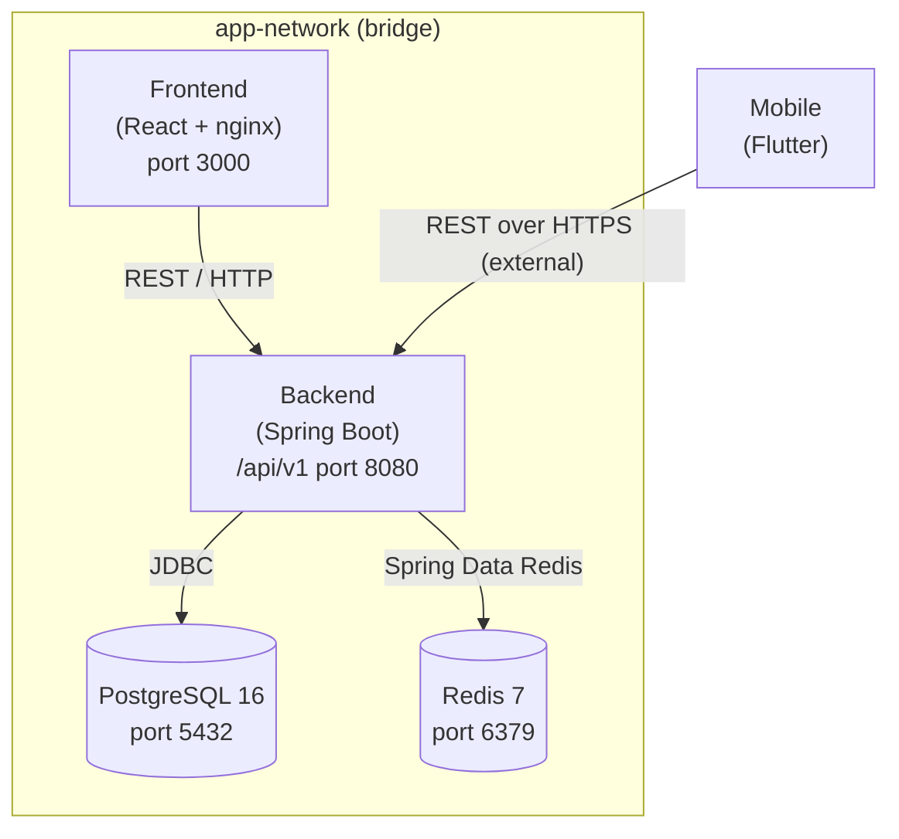

# Architecture

## High-Level System Design

This monorepo hosts four independently deployable services that communicate over a shared Podman network (`app-network`).



### Services

| Service    | Technology              | Port | Description                          |
| ---------- | ----------------------- | ---- | ------------------------------------ |
| `frontend` | React 18 + Vite + nginx | 3000 | SPA served via nginx; proxies `/api` |
| `backend`  | Spring Boot 3 / Java 21 | 8080 | REST API with JWT auth + caching     |
| `postgres` | PostgreSQL 16-alpine    | 5432 | Primary relational store             |
| `redis`    | Redis 7-alpine          | 6379 | Cache layer (TTL: 10 min default)    |

### Mobile

The Flutter app is a native mobile client (Android/iOS). It is not containerized; it communicates with the backend directly over HTTPS. In a CI environment a build-only container can be added.

---

## Container Communication

| Source   | Destination | Protocol | Notes                            |
| -------- | ----------- | -------- | -------------------------------- |
| frontend | backend     | HTTP     | nginx proxy; host: `backend`     |
| backend  | postgres    | TCP/5432 | JDBC; host: `postgres`           |
| backend  | redis       | TCP/6379 | Spring Data Redis; host: `redis` |
| mobile   | backend     | HTTPS    | External; configure via `.env`   |

All inter-container traffic stays on `app-network`. No service except `postgres` (5432) and `redis` (6379) are exposed externally in production — expose only `frontend` (80/443) and `backend` (8080) through a reverse proxy.

---

## Data Flow Diagram

### Login Request

```
Mobile / Browser
      │
      │  POST /api/v1/auth/login  {username, password}
      ▼
  Backend (AuthController)
      │
      ├─▶ UserRepository.findByUsername()  ──▶  PostgreSQL
      │
      ├─▶ PasswordEncoder.matches()
      │
      └─▶ JwtService.generateToken()  ──▶  return {token, username, role}
```

### Authenticated Request

```
Mobile / Browser
      │  GET /api/v1/<resource>
      │  Authorization: Bearer <jwt>
      ▼
  JwtAuthFilter (verify token)
      │
      ▼
  Controller ──▶ Service
                   │
                   ├─▶ Redis (cache hit?)  ──▶  return cached data
                   │
                   └─▶ PostgreSQL (cache miss)  ──▶  cache result  ──▶  return data
```
